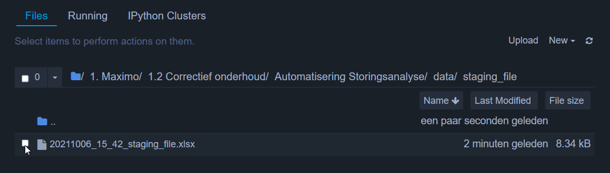
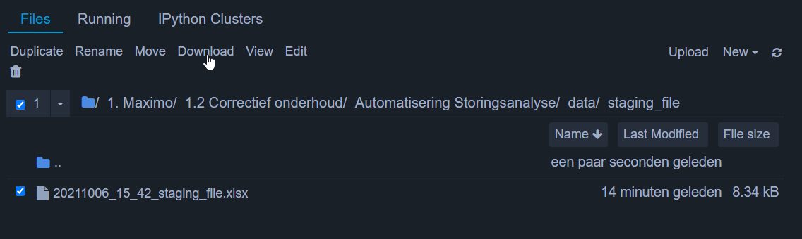
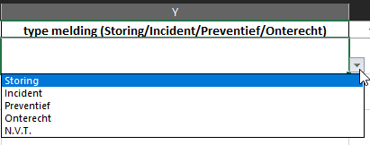
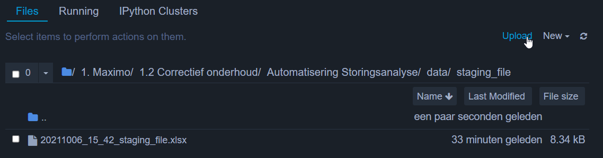

# Handleiding Storingsanalyse Generator
Dit Document dient als de handleiding ter ondersteuning van het genereren van de storingsanalyse en om de gebruiker 
de weg te wijzen langs de verschillende notebooks die zijn opgebouwd.

## Inhoud
De inhoud van deze handleiding bestaat uit de volgende punten.

1. [Processen](#Processen)

2. [Genereren van een nieuwe storingsanalyse](#Genereren-van-een-storingsanalyse)
    1. [Het genereren van een staging file.](#Genereren-van-een-staging-file)
    2. [Specificeren van het melding type.](#Specificeren-van-het-type-van-de-melding)
    3. [Genereren van de tekst en bijlage.](#Genereren-van-de-storingsanalyse-bestanden)
2. [Toevoegen van een nieuw project](#Toevoegen-van-een-nieuw-project)
3. Verdere ondersteuning (documenten, naslagwerk en/of trainingen)

## Processen
In de map `processen` staan een aantal processen. Deze processen worden in onderstaande tabel opgesomd met een korte
beschrijving van de taak/taken waar deze processen verantwoordlijk voor zijn.

|process|omschrijving|
|-------|------------|
|building_metadata_file| Opbouwen van de het metadata bestand. Het bestand met algemene informatie over het project en de historische data.|
|staging_file_builder| Bevragen van de Maximo database en het opbouwen van de staging file.|
|generating_storingsanalyse_documents| Genereren van de tekst en de bijlage voor het rapport van de storingsanalyse.|

## Genereren van een storingsanalyse
Het algehele proces van het genereren van een storingsanalyse rapport bestaat in grote lijnen uit drie aansluitende 
processen:

1. Het genereren van een staging file.
2. Het specificeren van het type van de verschillende meldingen in de staging file.
3. Het genereren van het tekst bestand en de bijbehorende bijlage.

### Genereren van een staging file
Het eerste proces dat men moet doorlopen, is het genereren van een staging file. Een staging file is een xlsx-bestand 
gevuld met regels die allemaal een melding representeren. Waarom dit bestand gegenereerd moet worden, is om de 
input van de maintenance engineers te krijgen en de verschillende meldingen te classificeren op basis van het type van
de melding.

Voor het genereren van een staging file is de notebook `staging_file_builder.ipynb` beschikbaar gemaakt in de map 
`processes/staging_file_builder`. De notebook is aangevuld met de specifieke stappen die doorlopen moeten worden 
voor het starten van, en na het uitvoeren van de notebook.

Wanneer de staging file gegenereerd is, moet het bestand handmatig gedownload worden uit de map `data/staging_file`.
Dit kan gedaan worden door het bestand te selecteren door het witte vierkantje voor de bestandsnaam te selecteren, om
vervolgens **Download** te selecteren (zie onderstaande afbeeldingen).

### Specificeren van het type van de melding
Wanneer het bestand is gedownload, moet er per melding het type van dee melding gespecificeerd worden. Dit is te 
realiseren door middel van de dropdown lijst die is toegevoegd aan de cellen in kolom Y (zie onderstaande afbeelding).

Als bij elke melding een type is toegevoegd, kan het bestand weer geupload worden in de serveromgeving. Het is hierbij 
van groot belang dat het oude bestand wordt verwijderd uit de map voordat de volgende stap wordt uitgevoerd.

Uploaden is mogelijk volgens de optie **Upload** rechtsboven op het scherm (zie onderstaande afbeelding).

### Genereren van de storingsanalyse bestanden
Voor het genereren van een staging file is de notebook `storingsanalyse_generator.ipynb` beschikbaar gemaakt in de map 
`processes/generating_storingsanalyse_documents`. De notebook is aangevuld met de specifieke stappen die doorlopen 
moeten worden voor het starten van, en na het uitvoeren van de notebook.

Na het doorlopen van het script, zijn de documenten beschikbaar in de map `documents/generated_documents`. Deze kunnen
worden gedownload zoals [hier](#Genereren-van-een-staging-file) omschereven.

## Toevoegen van een nieuw project

## Verdere ondersteuning
HIER BESCHRIJVEN WAT MEN MOET DOEN OM EEN NIEUWE LOCATION_MAPPING TOE TE VOEGEN.
